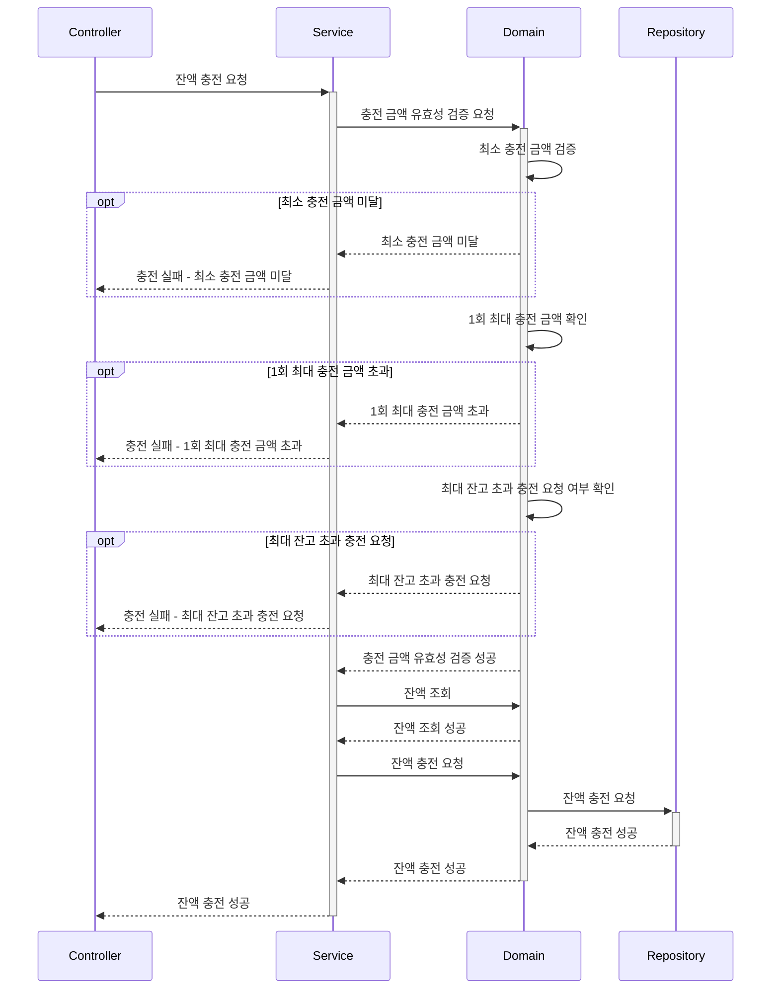
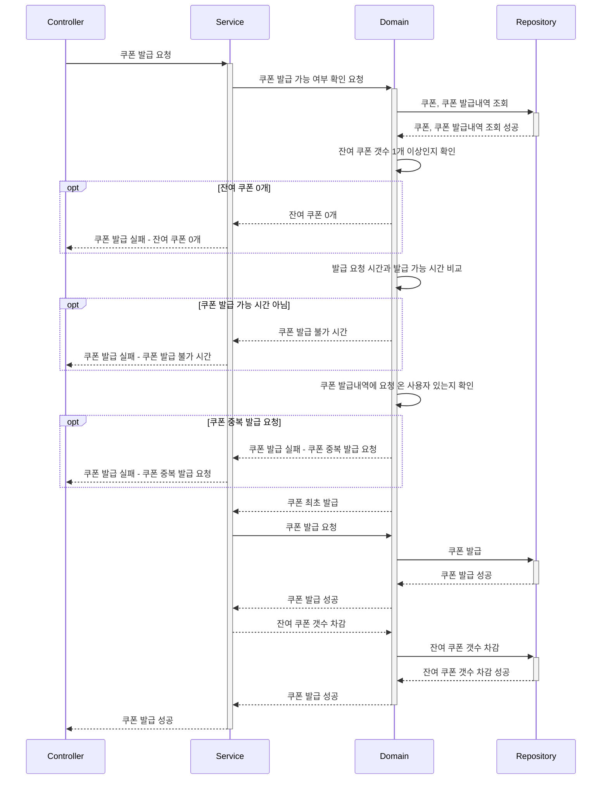
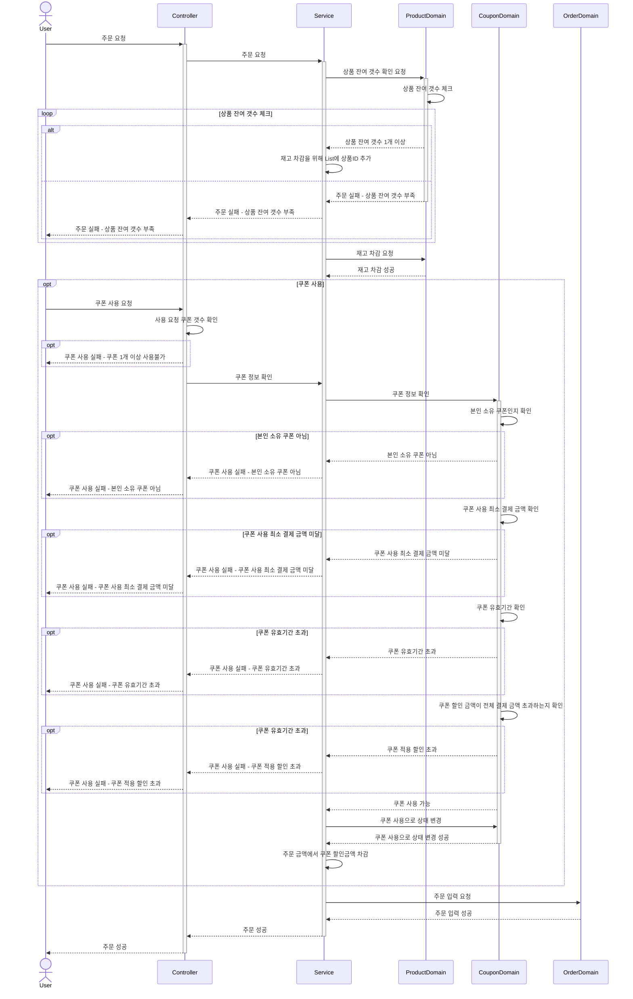
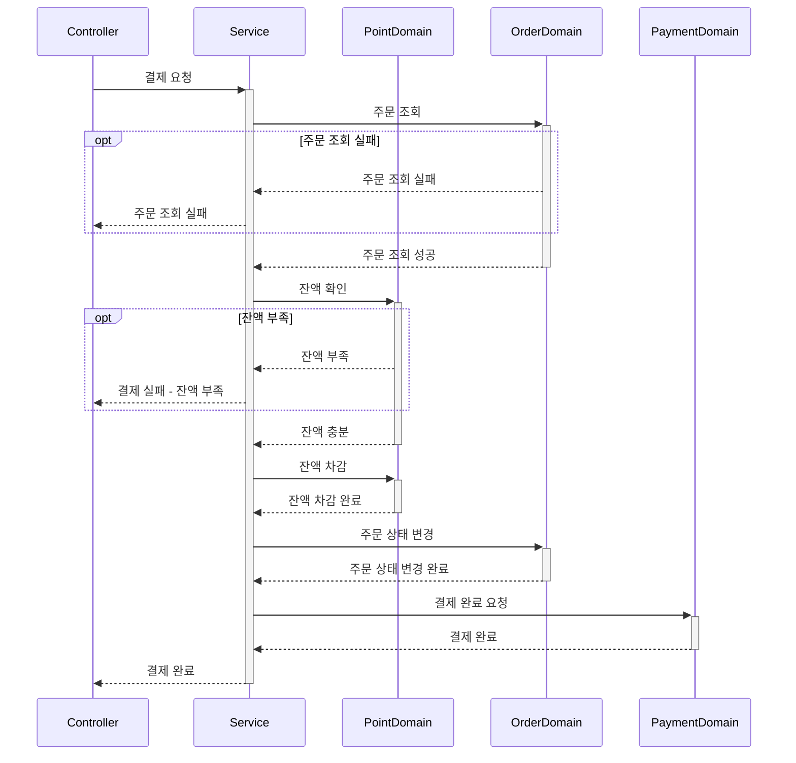

## 시퀀스 다이어그램

### 잔액 충전

```mermaid
sequenceDiagram
    participant Controller    
    participant Service
    participant Domain
    participant Repository

    Controller ->>+ Service: 잔액 충전 요청
    Service ->>+ Domain: 충전 금액 유효성 검증 요청
    Domain ->> Domain: 최소 충전 금액 검증
    opt 최소 충전 금액 미달
        Domain -->> Service: 최소 충전 금액 미달
        Service -->> Controller: 충전 실패 - 최소 충전 금액 미달
    end
    Domain->> Domain: 1회 최대 충전 금액 확인   
    opt 1회 최대 충전 금액 초과
        Domain -->> Service: 1회 최대 충전 금액 초과
        Service -->> Controller: 충전 실패 - 1회 최대 충전 금액 초과
    end
    Domain ->> Domain: 최대 잔고 초과 충전 요청 여부 확인  
    opt 최대 잔고 초과 충전 요청
        Domain -->> Service: 최대 잔고 초과 충전 요청
        Service -->> Controller: 충전 실패 - 최대 잔고 초과 충전 요청
    end
    Domain -->> Service: 충전 금액 유효성 검증 성공
    Service ->> Domain: 잔액 조회
    Domain -->> Service: 잔액 조회 성공
    Service ->> Domain: 잔액 충전 요청
    Domain ->>+ Repository: 잔액 충전 요청
    Repository -->>- Domain: 잔액 충전 성공
    Domain -->>- Service: 잔액 충전 성공
    Service -->>- Controller: 잔액 충전 성공
```

### 쿠폰 발급

```mermaid
sequenceDiagram
    participant Controller    
    participant Service
    participant Domain
    participant Repository

    Controller ->>+ Service: 쿠폰 발급 요청
    Service ->>+ Domain: 쿠폰 발급 가능 여부 확인 요청
    Domain ->>+ Repository: 쿠폰, 쿠폰 발급내역 조회
    Repository -->>- Domain: 쿠폰, 쿠폰 발급내역 조회 성공
    Domain ->> Domain: 잔여 쿠폰 갯수 1개 이상인지 확인
    opt 잔여 쿠폰 0개
        Domain -->> Service: 잔여 쿠폰 0개
        Service -->> Controller: 쿠폰 발급 실패 - 잔여 쿠폰 0개
    end
    Domain ->> Domain: 발급 요청 시간과 발급 가능 시간 비교
    opt 쿠폰 발급 가능 시간 아님
        Domain -->> Service: 쿠폰 발급 불가 시간
        Service -->> Controller: 쿠폰 발급 실패 - 쿠폰 발급 불가 시간
    end   
    Domain ->> Domain: 쿠폰 발급내역에 요청 온 사용자 있는지 확인    
    opt 쿠폰 중복 발급 요청
        Domain -->> Service: 쿠폰 발급 실패 - 쿠폰 중복 발급 요청
        Service -->> Controller: 쿠폰 발급 실패 - 쿠폰 중복 발급 요청
    end
    Domain -->> Service: 쿠폰 최초 발급
    Service ->> Domain: 쿠폰 발급 요청
    Domain ->>+ Repository: 쿠폰 발급
    Repository -->>- Domain: 쿠폰 발급 성공
    Domain -->> Service: 쿠폰 발급 성공
    Service -->> Domain: 잔여 쿠폰 갯수 차감
    Domain ->>+ Repository: 잔여 쿠폰 갯수 차감
    Repository -->>- Domain: 잔여 쿠폰 갯수 차감 성공
    Domain -->>- Service: 쿠폰 발급 성공
    Service -->>- Controller: 쿠폰 발급 성공
```

### 주문

```mermaid
sequenceDiagram
		actor User
    participant Controller    
    participant Service
    participant ProductDomain
    participant CouponDomain
    participant OrderDomain

		User ->>+ Controller: 주문 요청
    Controller ->>+ Service: 주문 요청
    Service ->>+ ProductDomain: 상품 잔여 갯수 확인 요청
    ProductDomain ->> ProductDomain: 상품 잔여 갯수 체크
    loop 상품 잔여 갯수 체크
	    alt 
	        ProductDomain -->> Service: 상품 잔여 갯수 1개 이상
	        Service ->> Service :재고 차감을 위해 List에 상품ID 추가
	    else
	        ProductDomain -->>- Service: 주문 실패 - 상품 잔여 갯수 부족
	        Service -->> Controller: 주문 실패 - 상품 잔여 갯수 부족
	        Controller -->> User: 주문 실패 - 상품 잔여 갯수 부족
	    end
    end
    Service ->> ProductDomain: 재고 차감 요청
    ProductDomain -->> Service: 재고 차감 성공
    opt 쿠폰 사용
        User ->> Controller: 쿠폰 사용 요청
        Controller ->> Controller: 사용 요청 쿠폰 갯수 확인
        opt
            Controller -->> User: 쿠폰 사용 실패 - 쿠폰 1개 이상 사용불가
        end     
        Controller ->> Service: 쿠폰 정보 확인
        Service ->>+ CouponDomain: 쿠폰 정보 확인                  
        CouponDomain ->> CouponDomain: 본인 소유 쿠폰인지 확인
        opt 본인 소유 쿠폰 아님
            CouponDomain -->> Service: 본인 소유 쿠폰 아님
            Service -->> Controller: 쿠폰 사용 실패 - 본인 소유 쿠폰 아님
            Controller -->> User: 쿠폰 사용 실패 - 본인 소유 쿠폰 아님
        end               
        CouponDomain ->> CouponDomain: 쿠폰 사용 최소 결제 금액 확인
        opt 쿠폰 사용 최소 결제 금액 미달
            CouponDomain -->> Service: 쿠폰 사용 최소 결제 금액 미달
            Service -->> Controller: 쿠폰 사용 실패 - 쿠폰 사용 최소 결제 금액 미달
            Controller-->> User: 쿠폰 사용 실패 - 쿠폰 사용 최소 결제 금액 미달
        end
        CouponDomain ->> CouponDomain: 쿠폰 유효기간 확인
        opt 쿠폰 유효기간 초과
            CouponDomain -->> Service: 쿠폰 유효기간 초과
            Service -->> Controller: 쿠폰 사용 실패 - 쿠폰 유효기간 초과
            Controller -->> User: 쿠폰 사용 실패 - 쿠폰 유효기간 초과
        end
        CouponDomain ->> CouponDomain: 쿠폰 할인 금액이 전체 결제 금액 초과하는지 확인
        opt 쿠폰 유효기간 초과
            CouponDomain -->> Service: 쿠폰 적용 할인 초과
            Service -->> Controller: 쿠폰 사용 실패 - 쿠폰 적용 할인 초과
            Controller-->> User: 쿠폰 사용 실패 - 쿠폰 적용 할인 초과
        end
        CouponDomain -->> Service: 쿠폰 사용 가능
        Service ->> CouponDomain: 쿠폰 사용으로 상태 변경
        CouponDomain -->>- Service: 쿠폰 사용으로 상태 변경 성공
        Service ->> Service : 주문 금액에서 쿠폰 할인금액 차감
    end
    Service ->> OrderDomain: 주문 입력 요청
    OrderDomain -->> Service: 주문 입력 성공
    Service -->>- Controller: 주문 성공
    Controller -->>- User: 주문 성공
```

### 결제

```mermaid
sequenceDiagram
    participant Controller    
    participant Service
    participant PointDomain   
    participant OrderDomain
    participant PaymentDomain
    
    Controller ->>+ Service: 결제 요청
    Service ->>+ OrderDomain: 주문 조회
    opt 주문 조회 실패
        OrderDomain -->> Service: 주문 조회 실패
        Service -->> Controller: 주문 조회 실패 
    end
    OrderDomain -->>- Service: 주문 조회 성공
    Service ->>+ PointDomain: 잔액 확인
    opt 잔액 부족
        PointDomain -->> Service: 잔액 부족
        Service -->> Controller: 결제 실패 - 잔액 부족
    end
    PointDomain -->>- Service: 잔액 충분
    Service ->>+ PointDomain: 잔액 차감
    PointDomain -->>- Service: 잔액 차감 완료
    Service ->>+ OrderDomain: 주문 상태 변경
    OrderDomain -->>- Service: 주문 상태 변경 완료
    Service ->>+ PaymentDomain: 결제 완료 요청
    PaymentDomain -->>- Service: 결제 완료
    Service -->>- Controller: 결제 완료
```