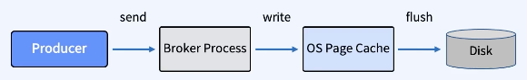
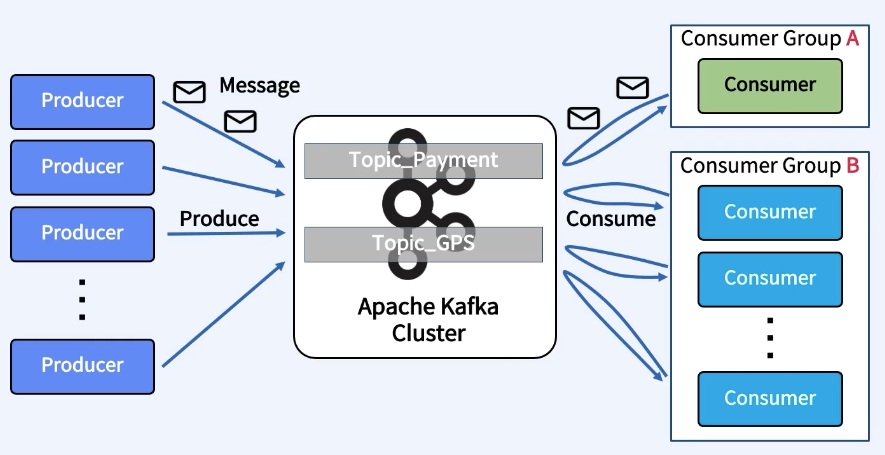
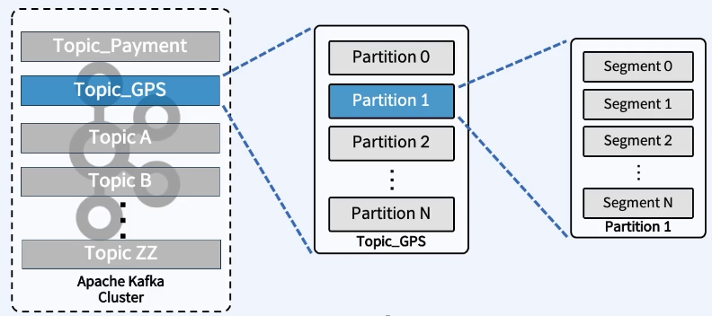
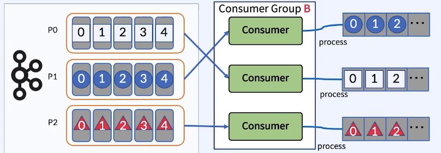
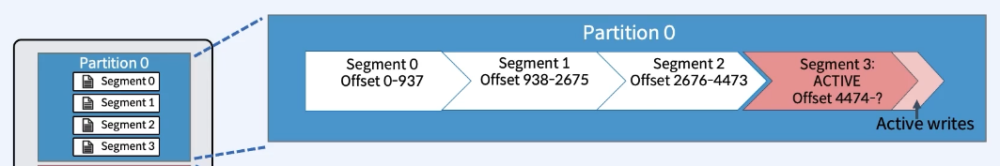
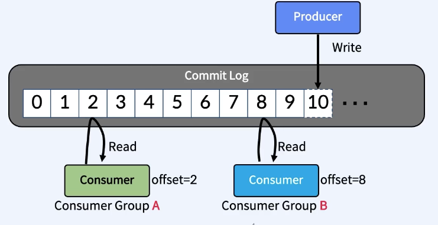
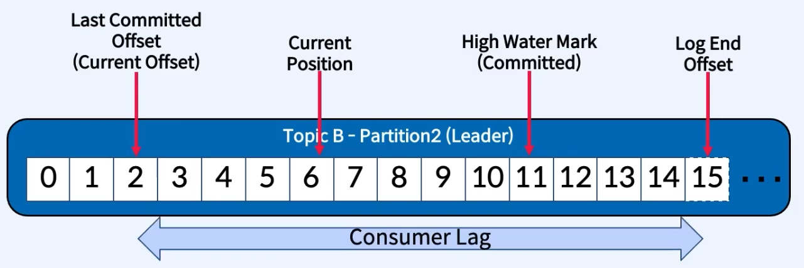
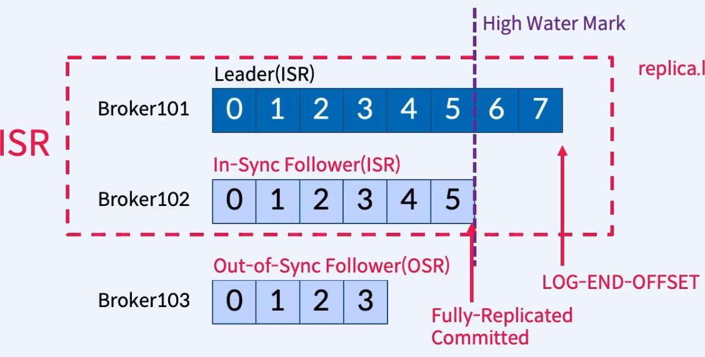

### Kafka?

Kafka는 **실시간 데이터를 전송하는 Disk 저장소 기반 Event Stream Platform**

(비즈니스에서 발생하는 모든 데이터를 Event로 정의)

---

### 특징

1. 이벤트 스트림을 **안전하게 전송(Publish & Subscribe)**
2. 이벤트 스트림을 **디스크에 저장(Write to Disk)**
3. 이벤트 스트림을 **분석및 처리(Processing & Ananlysis)에 사용**

---

### 사용처

1. 메세징 시스템
2. 실시간 로그 수집
3. 실시간 이벤트 스트리밍 프로세싱(이상 감지, 실시간 거래소)
4. DB 동기화(MSA 기반 분리된 DB간 동기화)
5. 빅데이터 기술과 함께 사용
6. 등등…

---

### 왜 처리 속도가 빠른가?

**카프카는 byte array로 데이터를 write하여 실제 데이터가 저장되는 partition의 log segment file에 zero-copy 실행**

- 저장 흐름

  

- **`zero-copy`**
    - **데이터가 User Space에 복사되지 않고, CPU 개입 없이 Page Cache와 Network Buffer사이에서 직접 전송되는 것**

      → **이로 인해 Broker Heap 메모리도 절약 가능하며 엄청난 처리량을 제공**

---

### 메세지 흐름

---

### Message

- **구조**
    - `Header`: Metadata이며 연결될 Topic, Partition, Value 타입(DTO 사용 가능) 등의 정보 지정
    - `Key/Value`: 다양한 형태의 데이터 타입 가능 → 비지니스에 활용될 데이터
- **특징**
    - Kafka는 메세지를 `Byte Array`로 변환하여 저장
    - Producer/Consumer 설정 단계에서 Serializer 지정
    - Producer/Consumer 설정으로 단건/배치 처리 둘 다 가능

---

### Producer

- **`Producer`**
    - 이벤트 메세지를 생산(Produce) 해서 Kafka Broker의 Topic으로 보내는 에플리케이션
- **Producer 전송 흐름**
    1. Producer
    2. Serializer(Byte Array로 변환)
    3. Partitioner(Partition분배) → (Hash Key % Partition 수) 알고리즘으로 분배 → Custom 가능 → 기본 설정은 Round Robin
    4. RecordAccumulator(배치 형태 or 건별로 데이터 전송)
    5. Broker
- **`Acks`**
    - Broker에 보낸 메세지가 정상 전달 됐다는 걸 인지하기 위한 Producer 설정
    - acks=0
        - 인지하지 않고 넘어감 → 메세지 손실이 다소 있더라도 빠르게 보내야하는 경우 사용
    - acks=1
        - default 설정
        - Follewer에 복제 되기 전 Leader에서 정상 전달 여부 반환 → Follower 복제전 Leader 장애 발생 시 메세지 유실될 수 있음
    - acks=-1 or acks=all
        - 모든 Replica에 메세지 복제 후 Leader가 정상 전달 여부 반환 → 대기 시간이 길고 특정 상황에서 메세지 중복이 발생 할 수 있음 → Follower에 메세지 복제 후 정상 전달 여부 응답 전 Leader 장애 발생 시 Producer는 정상 응답을 받지 않아 동일 메세지를 재발송 하게 될 수 있음(별도 옵션으로 중복 제어 가능)

---

### Consumer

- **`Consumer`**
    - Topic 내부 Partition의 메세지를 가져와서 소비(Consume)하는 애플리케이션
- **`Consumer Group`**
    - Partition의 메세지를 사용하기 위해 협력하는 Consumer들의 집합(분산 병렬 처리)
    - 하나의 Partition에 여러 Consumer들이 메세지를 가져갈 수 있으나 동일 Consumer Group 내부에서는 같은 Partition을 바라볼 수 없음
- **`Rebalancing`**
    - Consumer 장애 발생 시 Consumer Group내의 다른 Consumer가 장애 발생한 Consumer가 가져오던 Partition에서 메세지 가져와서 처리

### Kafka Server = Broker

- **`Broker`**: Kafka Server → 숫자로 된 ID로 식별됨
    - **`Controller`** → 2.7버전 이하는 Zookeeper라는 별도의 소프트웨어에 의존했음
        - 다른 Broker를 모니터링하고 장애가 발생한 Broker Topic의 Leader Partition을 재분배
        - Quorum(쿼럼) 알고리즘을 사용하여 분산 환경에서도 시스템의 일관성을 유지시키기 위해 사용
    - **`Coordinator`**
        - Consumer Group을 모니터링하고 그룹내 특정 Consumer 장애 시 Partition ↔ Consumer 재매칭 실행(Rebalance)
    - **`Topic`**
        - Kafka안에서 메세지가 저장되는 장소

      

    - **`Partition`**
        - 하나의 Topic의 하나 이상의 Partition으로 구성되며 병렬처리를 위해 다수의 Partition 사용
        - 서로 독립적으로 메세지 관리
        - 메세지 순서는 Partition 내에서만 보장됨 → Topic내의 전체 Partition에 대한 순서는 보장 불가 → 병렬 처리 되기 때문

          

        - 저장된 메세지는 변경 불가능(Immutable)
    - **`Segment`**
        - 메세지가 저장되는 실제 물리 File, 지정된 크기보다 크거나, 지정된 기간보다 오래되면 새 파일을 열어 메세지 저장
        - Rolling 정책: log.segment.byte(deafault 1GB), log.roll.hours(default 168 hours)

          

    - **`Commit Log`**
        - 추가만 가능하고 변경 불가능한 데이터 스트럭처, 끝에만 추가 가능
        - Producer/Consumer가 Topic에 Write/Read하기 위해 사용하는 저장소
        - Producer/Consumer는 서로 알지 못하며, 각각 고유의 속도로 Wirte/Read 수행
        - 다른 Consumer Group에 속한 Consumer끼리는 관련이 없으며, Commit Log에 있는 메세지를 동시에 다른 위치에서 Read 할 수 있음

      

    - **`offset`**
        - Commit Log에서의 메세지의 위치
        - 계속 증가하며 0으로 돌아가지 않음
        - Partition간 독립적으로 숫자 증가
        - Consumer Read 시 Internal Topic인 __consumer_offsets에

          [Consumer Group Name:Topic Name:Partition Id:Next offset] 형식으로 저장

    - **`Consumer Lag`**
        - Producer가 Write하는 LOG-END-OFFSET과 Consumer Group의 Consumer가 Read하고 Commit한 CUREENT-OFFSET과의 차이
        - `Last Committed Offset`(Current Offset): Consumer가 최종 Commit한 Offset
        - `Current Position`: Consumer가 읽어간 위치(처리 중, Commit 전)
        - `High Water Mark`(Committed): ISR(Leader ↔ Follower)간에 복제된 Offset
        - `Log End Offset`: Producer가 메세지를 보내서 저장된 로그의 맨 끝 Offset

      

---

### Replicas

- 장애가 발생한 Broker의 Partition을 대신해서 새로 Partition을 만들면 해결?
    - X → 기존 메세지와 offset 정보가 유실됨
    - 그렇기 때문에 Partition을 복제(Replication)하여 다른 Broker의 Partition의 복제물(Replicas)를 만들어 장애 시 메세지와 offset 정보가 유실되지 않도록 함
    - 이로인해 Kafka는 최소 3대 이상의 Broker를 클러스터링하여 구성하는걸 권장
- `Leader`
    - Producer가 전송한 원본 데이터를 가지고 있는 Partition
    - Leader에서만 write/read 발생 → Apache Kafka 2.4부터 Follower에서도 read 가능
    - Leader는 각 Broker에 고르게 분배됨 → 하나의 Broker에 write/read가 몰려 발생하는 부하 방지
- `Follower`
    - 복제를 해가고 있는 Partition
    - Leader의 Commit Log에서 데이터 `Fetch` 요청하여 복제
    - 장애 발생 시 새로운 Follower 중 하나를 Leader로 선출

---

### In-Sync_Replicas(ISR)

- 정말 잘 복제해가고 있는지 확인하는 지표
- High Water Mark 지점까지 동일한 Replicas(Leader 포함 산정됨)의 목록(아래의 이미지는 LOG-END-OFFSET과 Follower의 offset 차이가 4이상인 경우 ISR로 인식하지 않겠다는 설정이 된 경우 → 실제로는 offset 차이가 아닌 `Follower의 fetch` 요청 간격 차이로 ISR 인식 여부를 결정한다고 함)

---

### Kafka Connect

- 시스템 간 메세지 전송을 위해 사용
- 다른 데이터 시스템을 Kafka와 통합하는 과정을 표준화한 Framework
- 용어
    - `Connector`: Task를 관리하여 데이터 스트리밍을 조정하는 `Pulgin(jar), Java Class/Instance`
    - `Tasks`: Kafak와 다른 시스템간의 데이터를 전송하는 방법의 구현체(`Java Class/Instance`)
    - `Workers`: Connector 및 Task를 실행하는 `프로세스`
    - `Converters`: Connector와 데이터를 주고받는 시스템된 데이터를 변화하는데 사용되는 Componect(`Java Class`)
    - `Transforms`: Connector에 의해 생성되거나 Connector로 전송되는 각 메세지를 변경하는 Componenct(`Java Class`)
- Standalone vs Distributed Workers
    - Standalone Worker
        - 단일 워커로 동작 → Local Disk에 작성됨
        - 확장 불가 및 단일 장애 포인트
    - Dis
        - 클러스터로 구성된 워커
        - 확장 가능 및 분산된 워커