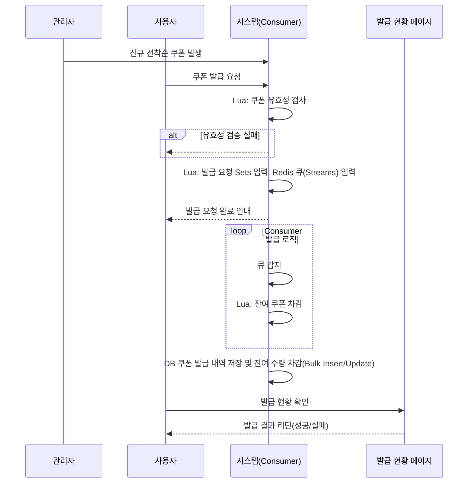
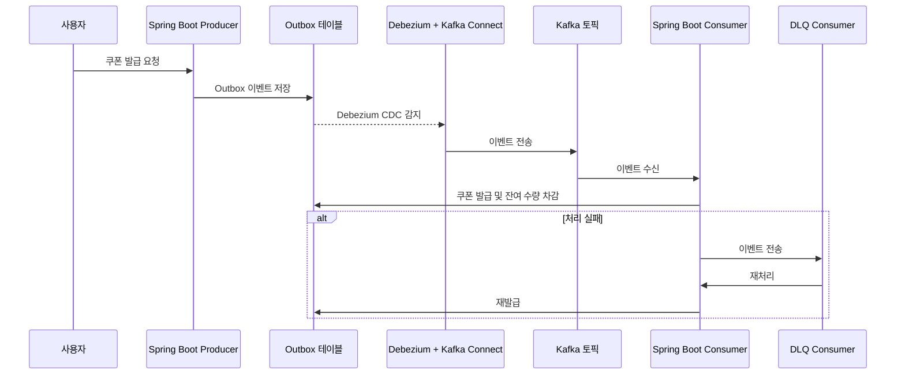

## **1. 기본 개념**

- **Kafka**: 대규모 이벤트 스트리밍 플랫폼. 분산 로그 저장소로서 **지속성, 확장성, 고가용성**에 최적화.
- **Redis Streams**: Redis(인메모리 데이터스토어)에 추가된 스트리밍 자료구조. **가볍고 빠른 메시지 큐** 용도로 적합.

---

## **2. 비교 항목별 정리**

| **항목** | **Kafka** | **Redis Streams** |
| --- | --- | --- |
| **저장 방식** | 디스크 기반 로그 저장 (segment files) → 장애 복구/재처리에 강함 | 메모리 기반 + 필요 시 RDB/AOF로 영속화 |
| **확장성** | 클러스터 기반 파티션/브로커 수평 확장 → 수백/수천 TPS 이상 | Redis Cluster로 수평 확장 가능하지만 Kafka만큼 대규모 스트리밍엔 덜 적합 |
| **내구성** | Replication + 디스크에 append-only → 강력 | 메모리 기반이라 상대적으로 약함 (단, AOF 사용 시 보완 가능) |
| **처리량 (Throughput)** | 고성능 (디스크 append-only + batch) → 초당 수십만 이벤트 처리 가능 | 빠름 (메모리 기반) → 소규모/중규모 트래픽엔 적합 |
| **지연 시간 (Latency)** | ms~수백 ms 수준 | 매우 낮음 (sub-ms 가능) |
| **소비 모델** | Consumer Group 기반 → 파티션 단위 병렬 처리 | Consumer Group 유사(XREADGROUP) 제공 → 메시지 ack, PEL 관리 필요 |
| **재처리 / 순서 보장** | 파티션 내 순서 보장, offset 기반 재처리 가능 | Stream 내 ID 순서 보장, 특정 consumer group에서만 ack 단위 관리 |
| **운영 복잡도** | Zookeeper/Controller, 브로커 운영 필요 → 상대적으로 무겁고 복잡 | Redis만 있으면 됨 → 간단 |
| **주요 사용 사례** | 로그 수집, 이벤트 스트리밍, 실시간 분석, 마이크로서비스 간 이벤트 버스 | 실시간 큐, 소규모 이벤트 처리, 간단한 Pub/Sub 대체 |

---

## **3. 언제 Kafka를 쓰면 좋은가?**

- 초당 수십만~수백만 이벤트를 처리해야 하는 경우
- 데이터 **내구성**과 **재처리 가능성**이 중요한 경우 (예: 결제 로그, 주문 이벤트)
- 대규모 **데이터 파이프라인 / 이벤트 스트리밍 플랫폼**이 필요한 경우
- Spark, Flink, Kafka Streams 같은 **스트리밍 처리 엔진**과 연동해야 할 때

---

## **4. 언제 Redis Streams가 적합한가?**

- 이미 Redis를 쓰고 있고 **간단한 메시지 큐**가 필요한 경우
- **낮은 지연 시간**이 중요한 경우 (실시간 알림, 채팅 메시지 등)
- 운영 복잡도를 줄이고 싶을 때 (Kafka 클러스터 구축 부담 ↓)
- 트래픽이 **중소규모**인 시스템 (예: 초당 수천~수만 건)

---

✅ 정리하면:

- **Kafka = 무겁지만 대규모 안정성·확장성 필요할 때**
- **Redis Streams = 가볍고 빠르게, Redis 기반으로 간단히 처리할 때**

---

## **1. 시나리오 간단 요약**

- 다수 사용자가 동시에 쿠폰 발급 요청
- **선착순 발급**, TTL 적용
- 발급 요청을 **큐잉 → 처리 워커** 구조로 수행

---

## **2. Kafka 적용**

### **장점**

1. **높은 내구성**
   - 브로커 디스크에 메시지 영속화 + replication → 서버 다운 후에도 메시지 손실 최소
2. **대규모 처리 가능**
   - 초당 수십~수백만 건 요청 처리 가능
   - Consumer Group으로 병렬 처리 가능 → 쿠폰 발급 워커 여러 개 운영 가능
3. **재처리 용이**
   - Offset 관리로 메시지 재처리 가능 → 쿠폰 발급 실패나 장애 발생 시 재시도 가능

### **단점**

1. **운영 복잡도**
   - Kafka 브로커 + Zookeeper 운영 필요 → 소규모 서비스엔 부담
2. **추가 지연**
   - 디스크 기반 + 네트워크 통신 → 몇 ms~수백 ms 지연
3. **Redis와 연계 필요**
   - 발급 상태 관리 / TTL 같은 Redis 기반 구조는 Kafka 메시지 처리 후 추가 처리 필요

---

## **3. Redis Streams 적용**

### **장점**

1. **빠른 처리 속도**
   - 메모리 기반 → 발급 요청 거의 실시간 처리 가능
2. **운영 단순**
   - 이미 Redis를 사용하고 있다면 별도 클러스터 운영 필요 없음
3. **소규모 트래픽에 적합**
   - 초당 수천~수만 건 처리 → 쿠폰 발급 정도에는 충분
4. **발급 상태 관리 용이**
   - Sorted Set/Hash와 쉽게 연계 → TTL, 발급 수 제한 구현 간단

### **단점**

1. **내구성 약함**
   - Redis 다운 시 메시지 손실 가능 (AOF/RDB 사용하면 일부 보완 가능)
2. **대규모 확장성 제한**
   - Redis Cluster로 분산 가능하지만 Kafka만큼 효율적이지 않음
3. **PEL 관리 필요**
   - XREADGROUP 사용 시 ack, pending entry list 직접 관리 → 재처리 로직 구현 필요
4. **유지 비용**
   - 데이터를 메모리에 올려 핸들링하여 대규모 트래픽 발생 시 유지 비용이 비싼 메모리 사용량이 높아짐

---

## **4. 쿠폰 발급 시스템 기준 추천**

| **기준** | **Kafka** | **Redis Streams** |
| --- | --- | --- |
| 트래픽 수준 | 매우 높음 (수십만 TPS 이상) | 중소규모 (수천수만 TPS) |
| 장애 복구 중요도 | 매우 중요 (재발급/재처리 필수) | 상대적으로 낮음 (실패 시 재시도 가능) |
| 운영 편의성 | 낮음 (클러스터 운영 필요) | 높음 (기존 Redis 활용 가능) |
| 응답 지연 요구 | 수 ms~100ms 가능 | sub-ms~몇 ms → 매우 빠름 |
| TTL/발급 제한 구현 용이성 | 별도 로직 필요 | Redis 자료구조 활용 가능 → 간단 |

✅ 결론:

- **중대형 서비스 + 높은 트래픽 + 데이터 내구성 중요** → Kafka
- **기존 Redis 사용 + 빠른 응답 + 운영 단순화가 중요** → Redis Streams

---

## 5. 시퀀스 다이어그램

### 레디스

참고: https://github.com/qkr107781/hhplus_e-commerce_server/blob/feature/docs/7.RedisDataTypesCoupon.md



### 카프카



---

# 📑 선착순 쿠폰 발급 시스템 Kafka 설계

## 1. 개요

제한된 수량(예: 100개) 선착순 쿠폰 발급을 안정적으로 처리하기 위해 **Kafka 기반 이벤트 스트리밍**과 **Outbox 패턴,Debezium + Kafka Connect**를 활용합니다.

주요 목표:

- 중복 발급 방지
- 잔여 수량 초과 방지
- 시스템 확장성 및 장애 대응
- 통합 테스트 환경 제공

---

## 2. 아키텍처 구성

### 2-1. 전체 흐름

```
사용자 요청
   │
   ▼
Producer (Spring Boot)
   │
   ▼
Outbox 테이블 (DB)
   │
   ▼
Debezium + Kafka Connect (독립 서비스, Docker Compose)
   │
   ▼
Kafka Topic
   │
   ▼
Consumer (Spring Boot)
   │
   ▼
쿠폰 발급 + 잔여 수량 차감 (DB)
   │
   ▼
(실패 시) DLQ → 재처리
```

```java
Producer
	1. 쿠폰 발급 요청
	2. 쿠폰 테이블에 잔여 갯수 조회 -> 느슨하게 체크 -> DB락 없이 조회
	3. Outbox 테이블 insert -> userId+couponId 유니크 키로 중복 방지
        userId
couponId
발급 요청 timestamp
status -> false, true

Debezium + Kafka Connect
	4. DB 로그에서 insert 감지하여 Kafka로 publish

Consumer
	5. partition에서 message consume
	6. 쿠폰 발급 유효성 검사 -> 정확하게 -> 잔여 수량 + 발급 처리가 원자적으로 처리되게
	7. 실패 시 DLQ -> 재처리
```

**2-2. 구성 요소 역할**

| **구성 요소** | **역할** |
| --- | --- |
| Producer | 사용자 발급 요청 처리 → Outbox 테이블 이벤트 저장 |
| Outbox 테이블 | DB 내 이벤트 로그 (userId + couponId 유니크) → 중복 방지 |
| Debezium + Kafka Connect | DB 변경 이벤트 감지, CDC → Kafka Topic 전송, 배치, 재시도, DLQ 처리 |
| Kafka Topic | 이벤트 스트리밍 → Consumer가 구독 |
| Consumer | Kafka 이벤트 처리 → 쿠폰 발급 및 DB 업데이트 |
| DLQ | Consumer 처리 실패 이벤트 저장 → 재처리 가능 |

2-3. Outbox DB 테이블

```sql
CREATE TABLE coupon_outbox (
    outbox_id BIGINT AUTO_INCREMENT PRIMARY KEY,
    user_id BIGINT NOT NULL,
    coupon_id BIGINT NOT NULL,
    status VARCHAR(20) DEFAULT 'PENDING',
    created_at TIMESTAMP DEFAULT CURRENT_TIMESTAMP,
    UNIQUE KEY idx_unique_coupon_outbox_coupon_id_user_id (user_id, coupon_id)
);
	•	status: PENDING, PROCESSED, FAILED 등 처리 상태 관리
	•	UNIQUE KEY: 중복 발급 방지
```

---

## **3. 장점 및 고려사항**

1. Outbox 패턴으로 **중복 발급 방지** 및 이벤트 추적 용이
2. Debezium + Kafka Connect 독립 서비스 → **배치, 재시도, DLQ 처리 자동화**
3. Testcontainers로 **운영 환경과 유사한 통합 테스트 가능**
4. DLQ 재처리로 **안정적 쿠폰 발급 보장**
5. Kafka 기반 이벤트 스트리밍으로 **확장성 및 병렬 처리** 용이

---