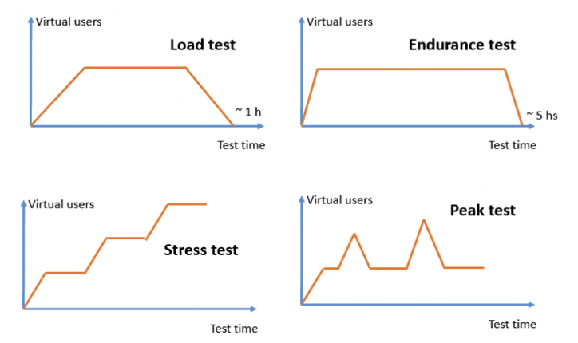
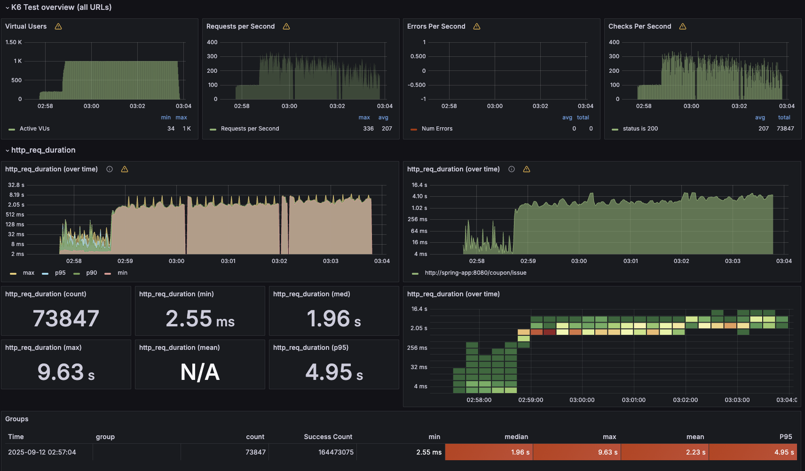
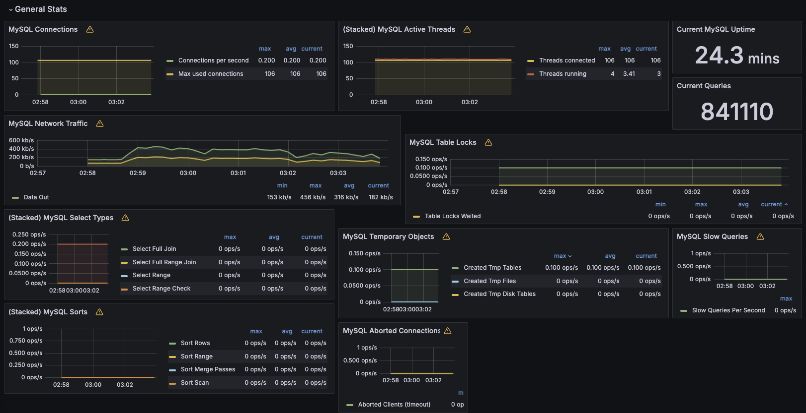
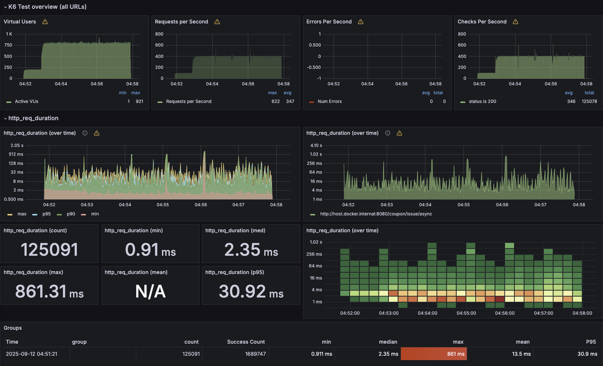
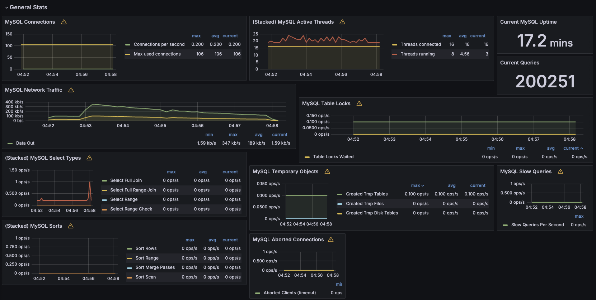
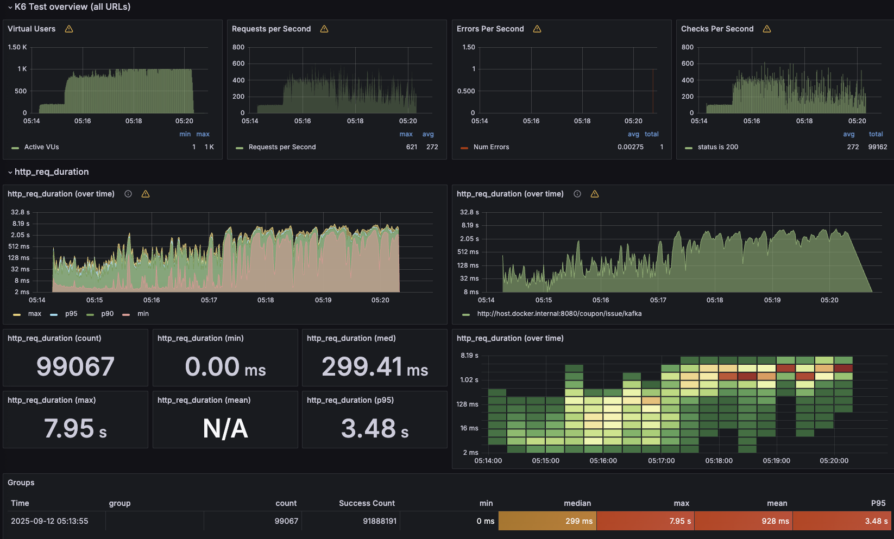
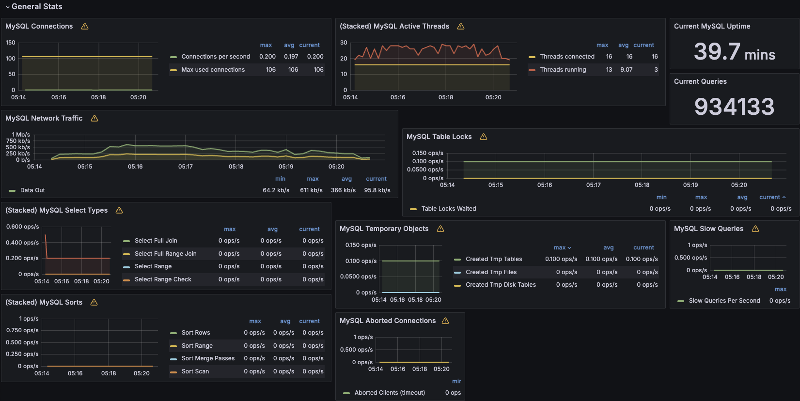

# **📝 부하테스트**
---
## **목적**

- 선착순 쿠폰 발급에서 다음 **동시성 제어** 방식의 성능/안정성 비교
    1. **DB Lock** 기반(비관 잠금) - [설계 문서 링크](5.Concurrency.md)
    2. **Redis Streams**(컨슈머 그룹) - [설계 문서 링크](7.RedisDataTypesCoupon.md)
    3. **Kafka + Debezium + Kafka Connect**(비동기 이벤트) - [설계 문서 링크](11.kafkaCoupon.md)
---
## **사전조건**

- *MacBook Air M1(16GB RAM) + Docker Desktop 환경에서 수행되었으며, 모든 서비스는 단일 Docker 네트워크에 구성*
- 유저 ID는 테스트 중 **고르게 분포**
- DB/Redis/Kafka **빈 상태**에서 시작
- 모든 서버는 도커 컨테이너로 등록하고 각 컨테이너별 vCPU/Mem 최대 사용량 제한

  각 서버는 1대 씩 기동 중

    - Spring Application: 4 core / 4g
    - MySQL: 4 core / 4g → max connection 100
    - Redis: 1 core / 1g
    - Kafka: 2 core / 2g
    - Kafka Connect: 1 core / 1g
    - K6: 2 core / 2g
    - grafana: 0.5 core / 1g
    - influxdb: 2 core / 2g

---
## **시나리오**

- 선착순 쿠폰은 한정된 수량을 특정 시간대에 발급 하는 이벤트로 많이 사용자가 동시간대에 무수히 많은 요청을 보낼 것으로 예상되므로 Peak Test로 진행하며 동시성 이슈를 방지하는 로직간의 성능 비교
- **Peak Test ( 최고 부하 테스트 )**
    - 갑작스런 고봉 트래픽(짧은 피크) → 회복 탄력성(**recovery**) 관찰
    - 시스템에 일시적으로 많은 부하가 가해졌을 때, 잘 처리하는지 평가
    - 목표치로 설정한 임계 부하를 일순간에 제공했을 때, 정상적으로 처리해내는지 파악
    - 선착순 이벤트 등을 준비하면서 정상적으로 서비스를 제공할 수 있을지 파악해 볼 수 있음


---
### 확인 지표

- **처리량**: RPS, 총 요청/성공/실패
- **지연시간**: **avg / p90 / p95 / max** (ms)
- **에러율**: **http_req_failed** (rate)
---
### **합격/경보 임계값(Thresholds)**

- http_req_failed < **1%**
- http_req_duration{p(95)} < **3000ms**
---
### 테스트 시나리오 스크립트

- 100,000개의 쿠폰을 5분안에 소진한다는 가정으로 목표 RPS 산정
- 각 로직별 (DB Lock, Redis, Kafka)
    - **최종 요청 건수, RPS, P95, error_rate** 비교
- **RPS**: 400
- **duration**: 5m
- **preAllocatedVUs**: RPS × 예상 평균 RT(초) × 1.2 정도 (예: 400 RPS, ~1s → **480** 근처)
- **maxVUs**: 여유 있게 **800~1000**
- **warmup**: 1분간 100~200 RPS로 워밍업 후 본 테스트 진입

```sql
import http from 'k6/http';
import { check, sleep } from 'k6';
import { randomIntBetween } from 'https://jslib.k6.io/k6-utils/1.4.0/index.js';

// 선착순 쿠폰 발급 부하 테스트 시나리오
export const options = {
  scenarios: {
    warmup: {
      executor: 'constant-arrival-rate',
      rate: 100,
      timeUnit: '1s',
      duration: '1m',
      preAllocatedVUs: 150,
      maxVUs: 300,
      startTime: '0s',
    },
    concurrent_coupon_issuance: {
        executor: 'constant-arrival-rate',    // 실행기(고정 도달율: RPS를 일정하게 유지)
        rate: 400,                            // 목표 도달률: 초당 400개의 요청
        timeUnit: '1s',                       // rate 단위: 1초당
        duration: '5m',                       // 총 실행 시간: 5분
        preAllocatedVUs: 400,                 // 미리 확보할 VU(가상 사용자) 수
        maxVUs: 1000,                         // 필요 시 늘어날 수 있는 VU 최대치
        startTime: '1m',                      // 워밍업 종료 후 본테스트 진행
    },
  },
  thresholds: {
    http_req_duration: ['p(95)<3000'],        // 응답 시간 95%가 3초 미만이어야 통과
    http_req_failed: ['rate<0.01'],           // 실패율이 1% 미만이어야 통과
  },
};

export default function () {
  // K6 실행 시 URL주입하여 호출
  const baseUrl = __ENV.BASE_URL;

  const payload = JSON.stringify({
    userId: randomIntBetween(1, 10000),  // 랜덤한 userId
    couponId: 3,  // 발급할 쿠폰 ID (예: 3번 쿠폰)
  });

  const params = {
    headers: {
      'Content-Type': 'application/json',
    },
  };

  const res = http.post(baseUrl, payload, params);

  // 응답 상태 코드 체크
  check(res, {
    'status is 200': (r) => r.status === 200,
  });

  sleep(Math.random() * 2 + 1);
}

export function handleSummary(data) {
  return {
    'summary.json': JSON.stringify(data, null, 2),
  };
}

```
---
### 테스트 결과
---
### DBLock

**K6 모니터링**


**MySQL 모니터링**



- **MySQL - max used connection 106**
- **최종 요청 건수: 73,847**
- **RPS: max 336, avg 207**
- **P95: 4.95s, max: 9.63s, min: 2.55ms**
- **error_rate: 0%**
- 안정성은 보장되나 동시적인 요청 발생 시 처리량의 한계가 있어보임(목표 RPS 400 달성 실패, Connection(100개) 모두 사용)
---
### Redis

**K6 모니터링**


**MySQL 모니터링**


- **MySQL - max used connection 106**
- **최종 요청 건수: 125,091**
- **RPS: max 622, avg 347**
- **P95: 30.92ms, max: 861.31ms, min: 2.35ms**
- **error_rate: 0%**
- 발급 완료 시에만 DB Insert/Update가 발생하여 현재 Connection 최대 사용 상태에서도 확실한 성능 이점 있음 → 비동기 큐 처리 방식으로 요청 후 처리되는 로직에서 Stream backlog가 쌓일 경우, 소비 지연 발생 가능
---
### Kafka

**K6 모니터링**


**MySQL 모니터링**



- **MySQL - max used connection 106**
- **최종 요청 건수: 99,067**
- **RPS: max 621, avg 272**
- **P95: 3.48s, max: 7.95s, min: 299.41ms**
- **error_rate: 0%**
- 테스트 중반까지 빠르게 처리되나 싶었지만 발급 요청 시 outbox 테이블에 insert하게 되어 병목 발생 → Outbox insert 병목으로 TPS 저하 + connector latency 발생하여 비동기 큐 처리 지연 발생 가능
---
### 결과 요약

| **방식** | 최종 요청 건수 | **RPS** | 목표 RPS(400) 달성률(avg 기준) | **p95** | error_rate | **비고** |
| --- | --- | --- | --- | --- | --- | --- |
| DB Lock | **73,847** | **max 336, avg 207** | **52%** | **4.95s** | **0%** | DB Lock 병목으로인한 성능 저하 |
| Redis Streams | **125,091** | **max 622, avg 347** | **86%** | **30.92ms** | **0%** | 빠른 성능, 그러나 비동기 처리에서의 부하 조심 |
| Kafka+Debezium | **99,067** | **max 621, avg 272** | **68%** | **3.48s** | **0%** | 요청 시 outbox DB Insert로 인한 병목, 요청이 몰릴 수록 부하가 발생 |
---
### 결론

이번 부하 테스트를 통해 **세 가지 동시성 제어 방식(DB Lock, Redis Streams, Kafka+Debezium)** 모두 안정적으로 쿠폰 발급의 동시성 문제를 처리할 수 있음을 확인하였다. 다만, 각 방식별로 성능 특성과 한계가 명확히 드러났다.

- **DB Lock**: 안정성은 확보되었으나, 높은 동시 요청 시 MySQL 커넥션 풀의 한계로 인해 처리량 저하가 발생하였다. 단기·소규모 이벤트에는 적용 가능하나, 대규모 트래픽 환경에서는 확장성 측면에서 한계가 있다.
- **Redis Streams**: 낮은 지연시간과 높은 처리량을 보여 가장 유리한 결과를 보였으나, 장시간 실행 시 Stream backlog 관리 및 소비자 그룹 지연 문제 가능성이 있어 추가 모니터링과 Failover 전략이 필요하다.
- **Kafka+Debezium**: 초반 처리 성능은 양호했으나, Outbox 테이블 Insert 시 병목 현상이 발생하여 TPS 저하가 관찰되었다. Connector 튜닝 및 Outbox 파티셔닝 전략 개선이 요구된다.

따라서, **중·대규모 트래픽 이벤트를 안정적으로 처리하기 위해서는 Redis Streams 기반 로직을 우선 고려**하되, 장기적으로는 **Kafka+Debezium** 구조의 병목 개선 및 스케일아웃 방안을 병행 검토할 필요가 있다. 또한, 모든 방식에 공통적으로 **DB Connection Pool 및 Docker 리소스 세팅 최적화**가 추가로 요구된다.

이번 테스트 결과는 단일 노드(Docker Desktop) 환경 기준이므로, 실제 운영 환경에 배포하기 전에는 **멀티 노드 분산 환경 및 장시간 Peak Test**를 추가 수행하여 안정성을 재검증하는 것이 바람직하다.