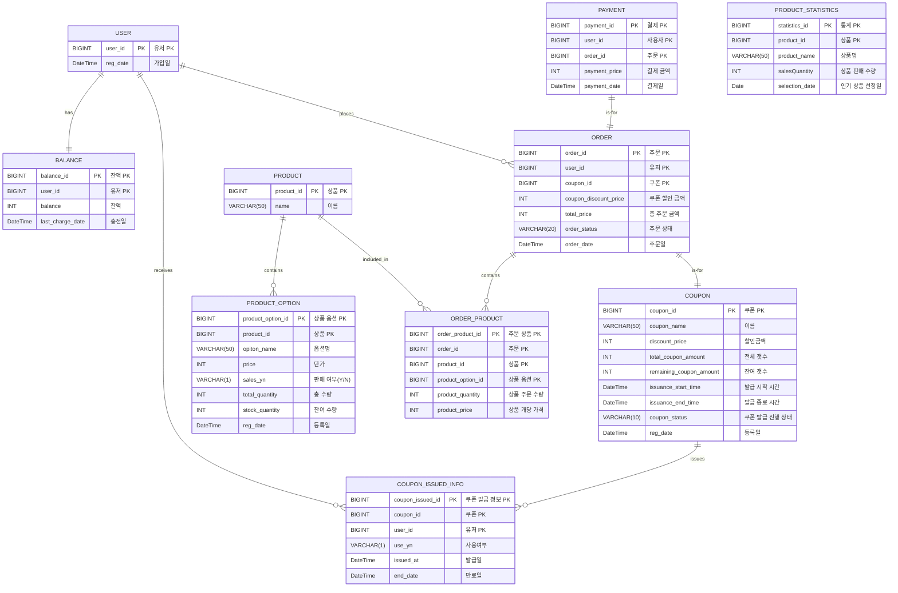

## ERD

## 코드성 데이터 정리

### PRODUCT_OPTION - sales_yn(판매 여부)

상품 조회 시 판매 중인 상품만 조회

| value | description |
| --- | --- |
| Y | 상품 공개 |
| N | 상품 비공개 |

### ORDER - order_status(주문 상태)

주문 완료 시 결제 대기 상태, 결제 완료 시 결제 완료 상태

| value | description |
| --- | --- |
| pending_payment | 결제 대기 |
| complete_payment | 결제 완료 |

### COUPON- coupon_status(쿠폰 발급 진행 상태)

주문 완료 시 결제 대기 상태, 결제 완료 시 결제 완료 상태

| value | description |
| --- | --- |
| pending | 결제 대기 |
| issuing | 발급 중 |
| closed | 발급 종료 |