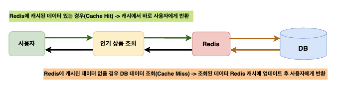
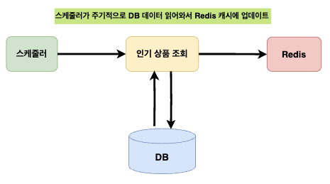

# 📄 Redis 캐시 적용 보고서

**주제:** 인기 상품 조회 기능 성능 개선을 위한 Redis 캐시 적용 전략

---

## 1. 목적

Redis에 자주 조회되는 데이터를 캐싱하여 **데이터베이스 조회 횟수를 줄이고**,

전체적인 시스템 응답 속도와 안정성을 향상

---

## 2. 대상

**인기 상품 조회 기능**

- **특징**: 조회/쓰기가 빈번하게 발생하는 **주문(Order)**, **상품(Product)** 관련 테이블 기반 통계 데이터
- **캐싱 목적**: 데이터베이스 접근 최소화 및 부하 완화

---

## 3. 분석

- 인기 상품 조회 쿼리는 **`IN`, `GROUP BY`, `ORDER BY`** 등의 연산이 포함되어 있어 다수의 요청 시 성능 저하 가능성이 높음.
- 해당 데이터는 **E-Commerce 핵심 테이블(주문, 상품)**에서 추출되므로 부하 시 사용자 응답 지연 가능성 존재.
- 데이터 변동이 적고 사용자 요청이 잦을 것으로 예상되므로 **Redis 캐시 처리**를 통해 반복 조회 부하를 줄이는 것이 효과적임.

---

## 4. 해결 전략

- **캐시 키**: `top5:sales:last3days`
- **TTL (Time To Live)**: 25시간
- 전략: **Read Through + Write Through 혼합 적용**
    - Read Through: 사용자 요청 시 캐시 먼저 확인, 없으면 DB 조회 후 캐시 저장
    - Write Through(배치): 주기적으로 캐시를 최신 데이터로 갱신

---

### 4.1 Read Through (사용자 요청 시)


```java
private static final String CACHE_NAME = "topSalesProducts";
private static final String CACHE_KEY = "'top5:sales:last3days'";
/**
 * 오늘 기준 4일 전부터 1일 전까지의 데이터 중 salesQuantity 기준 상위 5개를 조회합니다.
 * 예: 오늘이 7월 25일이면, 7월 21일 부터 7월 24일 까지의 데이터를 조회합니다.
 * @return 상위 5개 통계 데이터 리스트
 */
@Cacheable(
        cacheNames = CACHE_NAME,
        key = CACHE_KEY,
        unless = "#result == null  || #result.isEmpty()"
)
@Transactional(readOnly = true)
@Override
public List<ProductResponse.Statistics> selectTop5SalesProductBySpecificRange() {
    List<OrderProduct> orderProductListByBefore3Days = new ArrayList<>();

    LocalDate endDate = LocalDate.now();
    LocalDate startDate = LocalDate.now().minusDays(3);

    List<Order> orderList = orderService.selectOrderByOrderStatusAndOrderDateBetween("complete_payment", startDate, endDate);

    //추출일 기준 3일전~1일전 결제 완료된 주문의 주문 상품 조회
    for (Order order : orderList){
        List<OrderProduct> orderProductList = orderProductService.selectOrderProductsByOrderIdOrderByProductOptionIdAsc(order.getOrderId());
        orderProductListByBefore3Days.addAll(orderProductList);
    }

    List<OrderProductSummary> top5OrderProductList = orderProductService.getTop5OrderProduct(orderProductListByBefore3Days);

    return productStatisticsService.selectTop5SalesProductBySpecificRange(top5OrderProductList);
}
```

**특징**

- 사용자 요청 시 DB 부하 최소화
- 캐시 미스 시에만 DB 접근

---

### 4.2 Write Through (배치 기반 캐시 갱신)


```java
private static final String CACHE_NAME = "topSalesProducts";
private static final String CACHE_KEY = "'top5:sales:last3days'";

@CachePut(
        cacheNames = CACHE_NAME,
        key = CACHE_KEY
)
@Scheduled(cron = "0 0 0 * * *") // 매일 0:00 실행
public List<ProductResponse.Statistics> productStatisticsCache() {
    List<OrderProduct> orderProductListByBefore3Days = new ArrayList<>();

    LocalDate endDate = LocalDate.now();
    LocalDate startDate = LocalDate.now().minusDays(3);

    List<Order> orderList = orderService.selectOrderByOrderStatusAndOrderDateBetween("complete_payment", startDate, endDate);

    //추출일 기준 3일전~1일전 결제 완료된 주문의 주문 상품 조회
    for (Order order : orderList){
        List<OrderProduct> orderProductList = orderProductService.selectOrderProductsByOrderIdOrderByProductOptionIdAsc(order.getOrderId());
        orderProductListByBefore3Days.addAll(orderProductList);
    }

    List<OrderProductSummary> top5OrderProductList = orderProductService.getTop5OrderProduct(orderProductListByBefore3Days);

    return productStatisticsService.selectTop5SalesProductBySpecificRange(top5OrderProductList);
}
```

**특징**

- 배치 스케줄러를 통해 정해진 주기마다 최신 데이터로 캐시 갱신
- 캐시 TTL보다 짧은 주기로 갱신 시 항상 최신 데이터 제공 가능

---

## 5. 기대 효과

| 효과 | 설명 |
| --- | --- |
| 성능 향상 | 다수의 인기 상품 조회 요청을 캐시에서 처리하여 DB 부하 감소 |
| 안정성 강화 | DB 부하 급증 시에도 캐시 응답으로 서비스 안정성 유지 |
| 사용자 경험 개선 | 조회 속도 향상으로 빠른 응답 제공 |

---

## 6. 결론

인기 상품 조회 기능에 Read Through + Write Through 캐시 전략을 적용함으로써,

**조회 성능을 극대화**하고 **데이터베이스 부하 완화**

특히, **배치 기반 Write Through**를 통해 데이터 최신성과 안정성을 모두 확보 가능