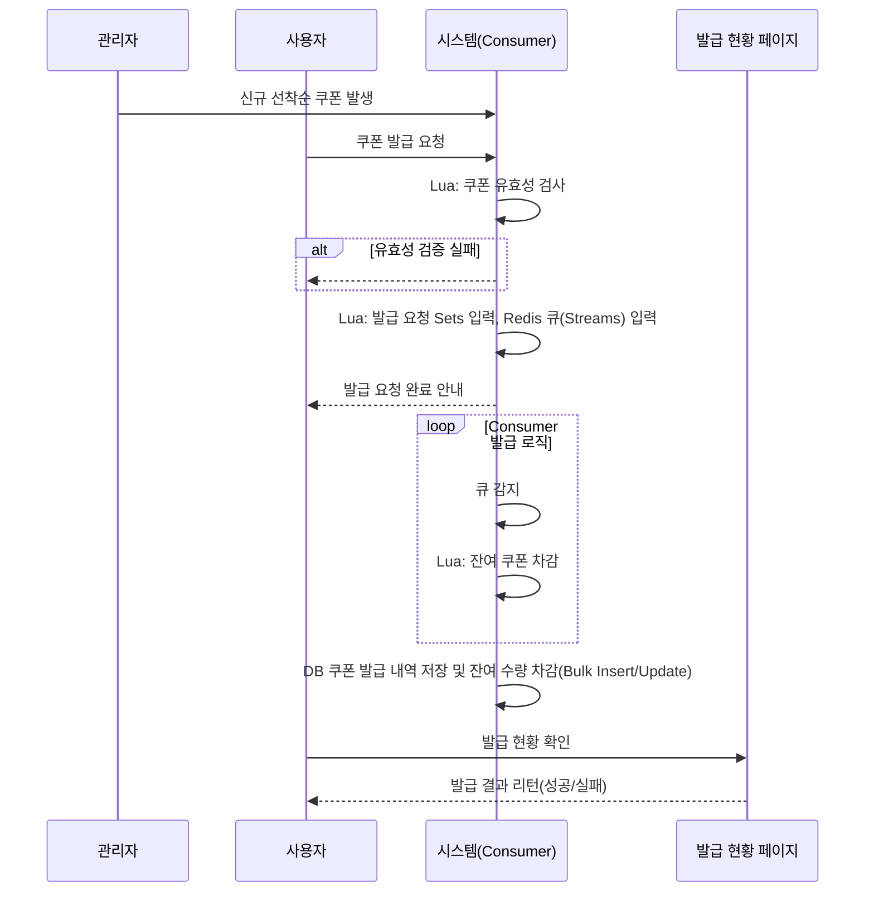

# 선착순 쿠폰 발급 시스템 설계 보고서

## 1. 개요

- 대량의 동시 접속자가 몰리는 환경에서 **안정적으로 선착순 쿠폰을 발급할 수 있게** Redis 기반 자료구조를 활용해 **선착순 + 중복 방지 + 동시성 제어 + 결과 영속성**을 안정적으로 처리
- Redis의 다양한 자료구조(`Hash`, `Set`, `Streams`)와 Lua 스크립트를 결합하여, 데이터베이스에 대한 부하를 최소화하면서도 정확성과 성능을 동시에 확보하는 데 중점을 두었습니다.

---

## 2. 고려사항

1. **기존 발급 로직 유지**
    - 유효성 검사, 제약조건 등 유지
2. **Race Condition**
    - 동시 요청으로 인한 과발급 가능 → Lua 스크립트로 원자적 차감 보장
3. **대기열 폭주 방지**
    - 발급 대기열 size 제한: 쿠폰 발급 총 수량 초과 시 발급 실패 리턴
4. **TTL 관리**
    - 발급 종료시간 초과되면 사라지도록 처리
    - 발급 작업 큐 데이터 DB 저장 후 사라지도록 처리
5. **발급 결과 조회 UX**
    - 요청 시 바로 성공 응답 X → Pending 상태 후 API 조회
6. **Redis 장애 대응**
    - 최종 영속성은 DB 활용
7. **고성능**
    - 수많은 사용자의 쿠폰 발급 요청을 빠르게 처리
8. **데이터 정합성**
    - 잔여 쿠폰 갯수 및 중복 발급 문제를 원자적(atomic)으로 처리하여 데이터의 일관성을 유지
9. **DB 부하 분산**
    - 쿠폰 발급 요청의 대부분을 Redis에서 처리하고, 최종 데이터만 데이터베이스에 비동기적으로 저장

---

## 3. 사용 자료 구조

### 1. **Streams → 사용자 발급 요청 작업 큐**

- **Key**: `coupon:queue:issue:job`
- **Entry**: `{#couponId:#userId}`
- **특징**
    - 큐 Blocking 상태로 대기하여 발급 요청 감지 시 CPU 자원 사용 최소화.
    - **TTL**: DB 저장 완료 시 제거
- **보완 포인트**
    - Stream은 중복을 허용하므로, Set을 활용해 **중복 요청 방지 로직**을 별도로 처리
    - **Lua 스크립트로 `SADD` + `XADD`를 원자적으로 실행**해 요청이 Set에 들어갈 때만 Stream에 기록되도록 함. → Stream 입력 실패 시 Set에서 제거

---

### 2. **Hashes → 쿠폰 메타 정보**

- **Key**: `coupon:#couponId:meta`
- **Fields**
    - `total_quantity`: 총 발급 수량
    - `remain_quantity`: 잔여 수량
    - `start_date`: 발급 시작일시
    - `end_date`: 발급 종료일시
- **특징**
    - 쿠폰 유효성 검사를 위함
    - Worker가 Stream 처리 시 빠르게 **유효성 검증** 가능.
    - **TTL**: 발급 종료일시 + 1시간

---

### 3. **Sets → 발급 요청 기록**

- **Key**: `coupon:#couponId:queue`
- **Member**: `#couponId:#userId`
- **특징**
    - 동일 유저가 여러 번 요청하지 못하게 **중복 차단**.
    - Stream과 함께 Lua 스크립트로 묶어 **중복 메시지 최소화** 가능.
    - **TTL**: 발급 종료일시 + 1시간.

---

## 4. 시나리오

### (1) 관리자 액션

```jsx
신규 쿠폰 발행 !
	쿠폰 meta 정보(Hashes) 입력
```

### (2) 사용자 액션

```jsx
발급 요청 !
	Java
		쿠폰 유효성 체크
			if(데이터 미존재 시) return ("발급 불가한 쿠폰")
			if(요청 시간 < 발급 시작일시) return ("발급 대기 중인 쿠폰")
			if(요청 시간 > 발급 종료일시) return ("발급 종료된 쿠폰")
	Lua	
		쿠폰 유효성 체크
			if(잔여 쿠폰 갯수 <= 0 || 발급 요청 건수 >= 총 쿠폰 갯수) return ("쿠폰 모두 소진")
		발급 요청 Sets 등록
			if(중복 요청) return ("중복된 발급 요청")
			TTL 설정 -> 종료일시+1시간
		발급 요청 작업 큐(선착순)	Streams 데이터 등록
			if(등록 실패) return Sets 롤백 

-------발급 요청 후 발급 상태 리턴-------
return ("발급 요청이 접수되었습니다. 발급 결과는 추후 확인해주세요.")

-------발급 요청 후 발급 상태 확인-------
사용자는 발급 현황 페이지에서 발급 결과 확인
```

### (3) 시스템 액션 (Worker)

```jsx
Consumer(백그라운드 실행) -> Streams 큐 감지 !
	Java
		신규 큐 감지
	Lua
		쿠폰 meta 정보(Hashes) 잔여 쿠폰 갯수 감소 -> 0개 이하 일때는 미실행 후 로직 종료
	Java
		큐 처리 완료(ACK)
		DB bulk Insert(쿠폰 발급 내역)/Update(쿠폰 잔여 수량)
		처리 완료 큐 삭제
```

---

## 5. 시퀀스 다이어그램



---

## 6. 핵심 컴포넌트 분석

### 사용자 요청 처리 - Redis Lua Script (`requestCouponIssue.lua`)

이 스크립트는 쿠폰 발급 요청의 **원자적 처리**를 담당하는 가장 중요한 부분입니다.

여러 Redis 명령어를 하나의 트랜잭션처럼 실행하여, 잔여 쿠폰 갯수 확인, 중복 발급 방지, Sets TTL 설정,그리고 대기열 추가를 단일 명령으로 수행합니다.

- **기능**:
    - `HGET` 쿠폰 meta 정보(`Hashes`)에 저장된 `remain_quantity` `total_quantity` 확인
    - `SADD` `couponId:userId` 발급 요청 기록(`Sets`)에 추가하여 **중복 요청 방지**
        - 이미 존재하는 멤버를 추가할 경우 `0`을 반환, 이를 통해 중복 요청 여부를 즉시 판단
    - `EXISTS`  발급 요청 기록(`Sets`) 데이터 최초 생성 시 TTL 설정(최초 1회 실행)
    - `SCARD` 발급 요청 기록(`Sets`)에 이미 존재하는 요청 수를 파악 → 총 수량 초과 검증
    - 모든 유효성 검사를 통과하면, `XADD` 명령을 사용하여 요청 정보를 **Redis Streams**에 추가
    - `XADD` 실패 시 `SREM` 으로 발급 요청 기록(`Sets`) 제거
- **장점**:
    - 네트워크 왕복(RTT)을 최소화하여 성능을 극대화
    - Redis의 단일 스레드 모델 덕분에 여러 작업이 한 번에 처리되어, 경쟁 상태(race condition) 없이 데이터 정합성 보장

### 선착순 대기열 - Redis Streams (`coupon:queue:issue:job`)

쿠폰 발급 요청을 **메시지 큐**처럼 사용하는 역할을 합니다.

- **기능**:
    - Lua 스크립트를 통해 유효성 검사를 통과한 요청들이 이 Streams에 순서대로 쌓임
    - **Stream**: 요청이 시간순으로 기록되는 로그 형태의 큐. 모든 이벤트가 append 방식으로 쌓임
    - **Consumer Group**: 여러 Consumer가 하나의 Stream을 나눠서 처리할 수 있도록 관리하는 단위. 메시지는 그룹 내 Consumer들에게 분배
    - **Consumer**: 실제로 메시지를 읽고 처리하는 개별 단위. 같은 그룹 안의 Consumer들이 협업하여 병렬 처리
    - **Pending Entries List (PEL)**: 읽혔지만 아직 처리 완료(ACK)되지 않은 메시지 목록. Consumer 장애 시 다른 Consumer가 가져와 재처리
- **장점**:
    - **처리 순서 보장**: 시간 기반 ID 값으로 정렬된 메시지를 들어온 순서대로 처리되므로 선착순 보장
    - **그룹 처리**: `XREADGROUP`을 통해 여러 Consumer가 메시지 그룹을 나누어 처리할 수 있어, 처리 속도 향상 및 시스템 확장 용이

### 발급 로직 - Consumer (`CouponWorkerRunner.java`)

쿠폰 발급의 최종 처리를 담당하는 비동기 프로세스입니다.

- **기능**:
    - Redis Streams의 메시지를 주기적으로 읽어옴 → 최대 50개, 5초 동안 Blocking 대기
    - 메시지에서 `couponId`와 `userId` 정보를 추출
    - 추출된 정보를 메모리에 모았다가, 레디스 처리 종료되면 **JDBC `bulkInsert`** 기능을 사용하여 한 번에 데이터베이스에 저장
    - 잔여 쿠폰 갯수도 동일하게 레디스 처리 종료 후 일괄 Update
    - Lua 스크립트로 레디스 쿠폰 meta 정보(`Hashes`) 잔여 쿠폰 갯수 차감 로직 원자성 보장
- **장점**:
    - **DB 부하 감소**: 하나의 요청마다 DB 쿼리를 실행하는 대신, 여러 요청을 모아서 한 번에 처리하므로 데이터베이스의 부하를 크게 줄일 수 있음
    - **주요 API와 분리**: 실제 발급 요청 처리와 데이터베이스 저장을 분리함으로써, 사용자는 빠른 응답을 받고 이후 처리는 백그라운드에서 진행

---

## 7. 기대 효과

- **성능 최적화**: Chunk 단위로 큐를 꺼내므로 DB/네트워크 부하 분산, Consumer 증가로 처리 속도 향상
- **안전성 보장**: Lua 스크립트를 통한 중복 발급 제어, 잔여 쿠폰 차감/복구 원자성 확보
- **확장성 확보**: Consumer 수평 확장이 가능

---

## **8. 추가 고려사항 (부록)**

### **1. 대안 기술과 트레이드오프**

- **Sorted Sets vs Lists vs Streams**
    - Sorted Sets는 선착순 순서 보장과 중복 방지에 효과적이지만, 발급 처리 부분 로직을 스케줄러로 구성해야 해서 불필요한 자원소모가 발생할 수 있음
    - Lists는 단순 큐로 활용 가능하지만, **컨슈머 그룹, PEL, 순서 보장, 재처리** 등의 기능이 부족함
    - Streams는 대규모 트래픽 상황에서 **안정적이고 확장성 있는 큐 처리**가 가능하므로 선택
- **Redis Only vs Redis + DB**
    - Redis는 메모리 기반이라 **영속성 한계** 존재
    - 최종 발급 내역과 쿠폰 수량은 반드시 DB에 반영하여 **장애 복구 및 데이터 정합성 확보**

### **2. 장애 및 에러 처리**

- **Consumer 장애**
    - Redis Streams의 Pending Entries List(PEL) 활용 → ACK되지 않은 메시지는 일정 시간이 지나면 다른 Consumer가 재처리
- **DB 저장 실패**
    - Bulk Insert 실패 시 재시도 큐(재처리 로직) 또는 Dead Letter Queue(DLQ)에 적재 후 별도 모니터링으로 처리 가능
- **Redis 장애**
    - Redis Sentinel/Cluster 구성으로 고가용성 확보
    - 장애 발생 시에도 DB에 저장된 데이터 기반으로 복구 가능

### **3. 운영 관점**

- **모니터링 포인트**
    - Redis Streams 큐 길이 (대기열 폭주 감지)
    - 쿠폰 Meta 정보의 잔여 수량 vs DB 수량 정합성
    - PEL에 장기간 남아있는 메시지 수 → 미처리 이벤트 여부 확인
- **TTL 기반 자동 정리**
    - 불필요한 Redis 키(coupon:meta, coupon:queue)가 만료되도록 설계해 메모리 효율성 확보