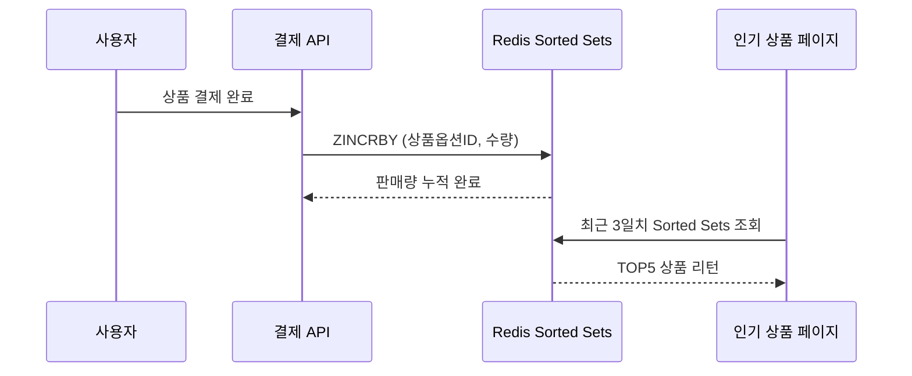

# **최근 3일간 인기 상품 조회 시스템 설계 보고서**

## **1. 개요**

- 사용자의 결제 데이터를 기반으로 **최근 3일간 가장 많이 판매된 TOP5 상품**을 조회하는 시스템을 설계.
- 대규모 트래픽 환경에서도 빠른 응답 속도를 보장하기 위해 **Redis Sorted Sets** 자료구조를 활용.
- TTL을 활용해 최근 3일간의 데이터만 Redis에 유지하여, **실시간성 + 효율성**을 동시에 달성하는 것을 목표로 함.

---

## **2. 고려사항**

1. **실시간 반영**
    - 결제 완료 이벤트 발생 시 즉시 Redis에 집계 반영.
2. **기간 한정 집계**
    - TTL을 설정하여 3일이 지난 데이터는 자동 삭제.
    - 불필요한 Redis 메모리 사용 방지.
3. **조회 성능 최적화**
    - DB Aggregation 대신 Redis 정렬된 자료구조를 활용해 즉시 TOP N 조회.
4. **데이터 정합성**
    - Redis는 캐싱/집계 용도 → 장애 발생 시 최종 기준은 DB(Order 테이블).
5. **운영 효율성**
    - 집계 데이터가 TTL 만료로 자동 정리되므로 운영자의 별도 개입 불필요.

---

## **3. 사용 자료 구조**

### **Sorted Sets → 일별 판매량 집계**

- **Key**: daily:sales:{yyyyMMdd}
- **Member**: productOptionId (상품 옵션 ID)
- **Score**: 해당 상품 옵션의 누적 판매 수량
- **특징**:
    - 판매 발생 시 addScore(productOptionId, quantity) 호출 → 스코어 증가.
    - TTL: 3일 + 1시간 → 최근 3일간 데이터만 유지.
    - Redis의 정렬 속성을 활용해 TOP5 상품을 즉시 조회 가능.

---

## **4. 시나리오**

### **(1) 결제 완료 이벤트**

- 결제 완료 시 오늘 날짜 기준으로 상품옵션 별 판매량 누적
- TTL로 3일 경과 시 자동 삭제

### **(2) 지난 3일간 인기 상품 TOP5 조회**

- 최근 3일치 Sorted Sets을 가져와 합산 → 상위 5개 상품 추출

---

## **5. 시퀀스 다이어그램**

---

## **6. 핵심 컴포넌트 분석**

### **updateDailyRanking()**

- 결제 완료 시 호출되는 메서드.
- 오늘 날짜 키(daily:sales:yyyyMMdd)를 기준으로 판매량 집계.
- TTL을 설정해 최근 3일치 데이터만 유지.

### **Redis Sorted Sets**

- 판매량(Score)에 따라 자동 정렬 → 인기 상품 순위 계산에 최적화.
- 날짜 기반으로 구성된 Key로 Sorted Sets에 ZREVRANGE 명령 실행하여 3일치 일자별 Sorted Sets 판매량 TOP5 조회.
- 중복 Member는 Score 합산하여 3일치 데이터 중 판매량 최종 상위 TOP5 상품 조회.

---

## **7. 기대 효과**

- **실시간 집계**: 결제 즉시 인기 순위에 반영.
- **빠른 조회**: Redis O(logN) 삽입, O(1) TOP N 조회 성능.
- **운영 효율성**: TTL 기반 자동 정리로 운영 부담 최소화.
- **확장성**: 집계 기간(3일 → 7일), 카테고리별 집계 등 확장 용이.

---

## **8. 보완점 및 향후 개선**

1. **데이터 정합성**
    - Redis 장애 시 데이터 유실 가능 → DB(Order 테이블) 기반 재집계 방어 로직 필요.
    - 결제 트랜잭션 완료 전 실행 되므로 DB ↔ Redis 간 데이터 불일치 발생.
2. **추가 지표 확장**
    - 단순 판매량 외에도 매출액(판매가×수량), 카테고리별 인기 상품 지표로 확장 가능.
    - 상품 갯수가 누적되어 Sorted Sets 성능이 저하된 경우를 대비하여 리팩토링 필요.

---