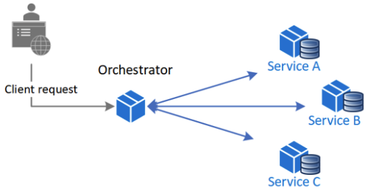
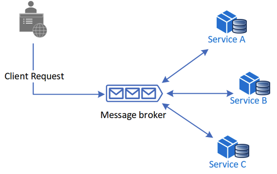
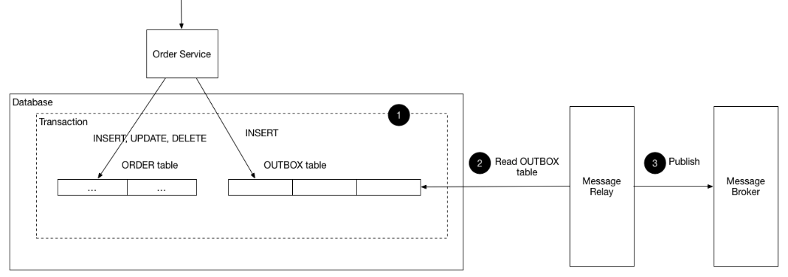

# **📑 MSA 아키텍처 전환 설계**

## **1. 개요**

현재 시스템은 모놀리식 아키텍처 기반으로 구성되어 있어, 서비스 확장성·유연성·운영 효율성 측면에서 한계가 존재합니다. 이를 해결하기 위해 **MSA 기반 아키텍처**로 전환하고, 각 **도메인을 독립적인 서비스와 개별 데이터베이스**로 분리하여 운영하고자 합니다.

---

## 2. 모놀리식 vs MSA

| **구분** | **모놀리식 아키텍처** | **MSA 아키텍처**              |
| --- | --- |---------------------------|
| **도메인 분리** | 모든 기능이 하나의 코드베이스와 DB에 결합 → 서비스 간 경계 모호 | 도메인 분리 및 팀 단위 서비스/데이터 베이스 |
| **확장성** | 전체 애플리케이션 단위로만 확장 가능 → 불필요한 자원 낭비 | 특정 서비스만 개별적으로 확장          |
| **배포 유연성** | 작은 변경도 전체 서비스 재배포 필요 → 배포 위험도 증가 | 서비스 단위 독립 배포 가능           |
| **장애 격리** | 특정 기능 장애가 전체 시스템에 영향 (단일 DB 장애 = 전체 다운) | 서비스·DB 단위 장애 격리           |
| **성능 최적화** | 단일 DB에 부하 집중, 기능 특화 최적화 한계 | 도메인별 데이터베이스 최적화 전략 적용     |
| **운영 효율성** | 운영은 단순하지만 서비스 커질수록 복잡성 급증 (코드/DB 스키마 거대화) | 운영 복잡도 증가, 모니터링·자동화 체계 도입으로 효율적 운영 가능               |

---

## **3. 목표**

- **도메인 분리 및 팀 단위 서비스/데이터 베이스**

    → 서비스 소유권 명확화, 팀 단위 서비스 개발/운영, 독립적인 데이터 베이스 관리

- **특정 서비스만 개별적으로 확장**

    → 특정 도메인(예: 주문, 결제)의 트래픽 폭주 시 해당 도메인만 Auto Scaling 적용하여 유연하게 대처 가능

- **서비스 단위 독립 배포 가능**

    → 특정 서비스의 변경 및 배포가 다른 서비스에 영향을 주지 않도록 하여 개발 및 배포 주기를 단축

- **서비스·DB 단위 장애 격리**

    → 서비스 단위 장애 발생 시 전체 시스템 영향 최소화

    → DB 분리로 특정 데이터베이스 장애가 다른 서비스로 전파 방지

- **도메인별 데이터베이스 최적화 전략 적용 -**  **(Polyglot Persistence - 도메인별 맞춤형 DB 전략)**

    → 도메인 특성에 맞는 최적의 데이터베이스를 사용하여 성능을 극대화하고 운영 효율성 향상

- **체계적인 운영 관리**

    → 모니터링 및 자동화 체계를 도입하여 분산 환경의 복잡성을 관리하고 효율적인 운영 기반을 마련

---

## **4. 도메인 분리**

- **기준: 비즈니스 관점의 경계(Bounded Context)**
- 각 도메인은 **독립적 배포/확장** 가능해야 함
- 서비스 간 의존성은 최소화하고, **비동기 이벤트 기반 통신** 활용
- 분리 도메인

    → 잔액(Balance), 상품(Product), 주문(Order), 결제(Payment), 쿠폰(Coupon)

---

## **5. 고려 사항 및 해결 방안**

### **5.1 기술적 변화**

1. **트랜잭션 관리**
    - 기존 모놀리식 환경 + 단일 데이터 베이스에서는 쿠폰 사용 → 재고 차감 → 주문 생성의 시나리오를 하나의 트랜잭션으로 묶어 관리
    - MSA 환경에서는 서비스별 독립적인 트랜잭션 운영, 분산 트랜잭션 보완 패턴 적용 필요
    - **SAGA 패턴**: 일련의 보상 트랜잭션을 통해 분산된 작업의 일관성 유지
        - **분산 트랜잭션 대신 보상 트랜잭션(Compensating Transaction)** 으로 최종 일관성을 보장
        - 여러 서비스가 참여하는 긴 작업을 **여러 개의 지역 트랜잭션(Local Transaction)** 으로 나눔
        - 데이터의 롤백 대신 실패 시 이전 단계까지 실행된 트랜잭션을 취소(보상)하는 트랜잭션 실행
        - 구현 방식
            - **Orchestration**: 중앙 조정자가 전체 흐름을 관리
                - 장점
                    - **중앙집중 관리**: 흐름이 명확하고 한 곳에서 관리 가능 → 유지보수 쉬움
                    - **에러 처리 용이**: 실패 시 보상 로직 제어가 단일화됨
                    - **추적성↑**: 어떤 서비스에서 실패했는지 Orchestrator가 기록/관리
                - 단점
                    - **Orchestrator 서비스가 단일 장애점(SPOF)** 될 수 있음
                    - **의존성 증가**: Orchestrator가 모든 흐름을 알고 있어야 함 → 결합도 상승
                    - **확장성 제약**: 서비스가 늘어날수록 Orchestrator 로직이 복잡해짐

            
      
            SAGA Pattern - Orchestration, Choreography (출처: https://learn.microsoft.com/ko-kr/azure/architecture/patterns/saga)  
            - **Choreography**: 서비스 간 이벤트(Message)를 발행/구독하여 분산적으로 트랜잭션 흐름 관리
                - 장점
                    - **서비스 간 결합도 낮음** → MSA 원칙에 부합
                    - **확장성↑**: 신규 서비스가 이벤트 구독만 하면 참여 가능
                    - **중앙 장애점 없음**: 이벤트 기반 분산 제어
                - 단점
                    - **흐름 추적 어려움**: 이벤트가 서비스 간에 흩어져 관리 → 장애 분석 난이도↑
                    - **보상 트랜잭션 복잡**: 각 서비스가 보상 로직을 직접 구현/발행해야 함
                    - **중복 이벤트 처리 필요**: 멱등성 보장이 필수

            
      
            SAGA Pattern - Orchestration, Choreography (출처: https://learn.microsoft.com/ko-kr/azure/architecture/patterns/saga)

    - **TCC(Try-Confirm-Cancel)**: 분산된 작업의 실행, 확정, 취소 관리
        - 각 서비스가 **3단계의 로직 구현**
            - **Try** → 자원 확보(예약), 조건 검증
            - **Confirm** → 최종 확정(Commit)
            - **Cancel** → 자원 회수(보상 트랜잭션)
        - ACID 대신 최종적 일관성(Eventual Consistency)을 추구
        - 일반 DB 트랜잭션(2PC)보다는 유연하고 장애에 강함
        - 장점
            - **데이터 정합성 보장**: Confirm단계에서만 확정 → 실패 시 Cancel로 복구
            - **자원 선점 가능**: Try 단계에서 자원 임시 확보 → 동시성 이슈 방지
            - **분산 환경 적합**: 서비스별 독립적인 트랜잭션
            - **유연한 보상처리**: Cancel 단계에서 로직에 맞는 보상 처리 가능
        - 단점
            - **복잡한 구현**: 서비스 마다 3단계의 로직 구현 필요 → 보상 로직도 별도로 구현 필요
            - **성능 부담**: 자원 확보 시 임시로 다른 요청이 접근 못하게하여 병목 현상 발생
            - **Cancel 복구 처리에 실패 시 정합성**: 보상 로직 실패 시 정합성 깨질 위험 존재

            
      
            TCC Pattern (출처: [https://www.popit.kr/rest-기반의-간단한-분산-트랜잭션-구현-1편/](https://www.popit.kr/rest-%EA%B8%B0%EB%B0%98%EC%9D%98-%EA%B0%84%EB%8B%A8%ED%95%9C-%EB%B6%84%EC%82%B0-%ED%8A%B8%EB%9E%9C%EC%9E%AD%EC%85%98-%EA%B5%AC%ED%98%84-1%ED%8E%B8/))

    - **Outbox 패턴**: 데이터베이스 트랜잭션과 메시지 전송을 원자적으로 처리하여 이벤트 발행 보장
        - 이벤트 발행 시 데이터베이스 트랜잭션과 메시지 전송을 **원자적으로 보장**
        - **Outbox**: 로컬 DB에 이벤트 저장 → 별도 프로세스가 메시지 브로커에 발행
        - 장점
            - **데이터 정합성 보장**: DB Update와 이벤트 발행을 원자적으로 수행
            - **이벤트 순서 보장**: 분산 환경에서도 Outbox 테이블로 이벤트 순서 보장
            - **장애 복구 용이**: 브로커 실행 전 오류 발생하여도 Outbox 테이블 기반으로 재처리 가능
        - 단점
            - **데이터 관리**: 이벤트 데이터가 OutBox 테이블에 누적되어 관리 필요
            - **운영 복잡도 증가**: 추가 Relay 컴포넌트와 Outbox 테이블, 모니터링 등 관리 포인트 증가

            
      
            Transactional Outbox Pattern (출처 : https://microservices.io/patterns/data/transactional-outbox.html)

2. **도메인별 데이터베이스 최적화 전략**

    | **도메인** | **DB 전략** | **특징** |
    | --- | --- | --- |
    | 주문/결제 | RDB + CQRS | 트랜잭션/조회 최적화 |
    | 상품 | RDB + 캐싱 + Redis 분산락 | 조회 성능 + 재고 동시성 처리 |
    | 쿠폰 | RDB + 메시지 큐 | 선착순 발급, 이벤트 순서 보장 |
    | 잔액 | RDB + Redis 분산락 | 동시성 제어 및 보상 트랜잭션 지원 |

---

### **5.2 운영적 관점**

1. **모니터링 & 관측성**
    - 분산 트레이싱(TraceID) 적용 → 서비스 간 요청 흐름 추적
    - 서비스·DB 메트릭 기반 알림 (Prometheus, Grafana)
    - 로그 상관관계 ID를 통한 문제 원인 파악
2. **이벤트 처리 실패 대응**
    - DLQ(Dead Letter Queue) 활용하여 실패 이벤트 격리 → 모니터링하여 관리자 직접 처리 혹은 운영 경험치가 쌓인 후라면 자동 처리되도록 설정
    - 재처리 메커니즘 제공 → 데이터 유실 최소화
    - Circuit Breaker 적용으로 장애 전파 방지
3. **장애 격리 & 복구**
    - Bulkhead 패턴 적용(자원 풀 분리)
    - Chaos Engineering 도입 → 장애 대응력 강화
    - 서비스 장애 시 graceful degradation (부분 서비스만 중단)

---

### **5.3 조직적 변화**

- **컨웨이 법칙**에 따라 조직 구조와 아키텍처를 일치시켜야 함

    → 주문팀, 결제팀, 상품팀 등 도메인 단위 팀 운영

- 팀은 각 서비스 전체 라이프사이클(개발-배포-운영)에 대한 책임을 가짐
- 다양한 기술 스택(RDB, Redis, ElasticSearch, Kafka 등)을 관리할 수 있도록 DevOps/플랫폼 팀 필요
- 구성원의 **분산 시스템 이해도** 및 **운영 자동화 역량** 강화 필요

---

## **6. 트랜잭션 처리의 한계**

위 고려사항 및 해결방안 중 **트랜잭션 관리** 항목에서는 4가지 패턴과 도메인별 데이터베이스 최적화 전략을 정리했습니다.

각 패턴은 장단점이 뚜렷하여, 사용 목적에 맞게 적절히 적용하는 것이 중요합니다.

- **Orchestration**: 중앙 조정자로 트랜잭션 흐름 관리, 추적과 오류 처리 용이
- **Choreography**: 전체 시나리오 흐름 관리
- **Outbox**: 이벤트 순서 보장 & 데이터 정합성 확보
- **TCC**: 트랜잭션 원자성 + 동시성 문제 해결

또한 4가지 패턴을 상호 보완적으로 활용하고, 도메인별 데이터베이스 최적화 전략을 병행하면 시스템의 안정성, 성능, 운영 편의성을 동시에 향상시킬 수 있습니다.

예를 들어, 트랜잭션 시나리오의 흐름은 **Choreography/Orchestration 패턴**으로 관리하되,

- **선착순 쿠폰 발급**과 같이 정합성과 순서 보장이 중요한 기능에는 **Outbox 패턴**을 추가하여 이벤트 순서와 데이터 정합성을 보장하고,
- **주문/결제**와 같이 트랜잭션의 원자성과 데이터 정합성이 중요한 기능에는 **TCC 패턴**을 적용하여 동시성 문제를 방지하고 유연한 보상 트랜잭션을 구현할 수 있습니다.

다만, MSA 환경은 서비스가 독립적이고 분산되어 있어, 트랜잭션 시나리오의 흐름 파악이 어려울 수 있습니다.

이로 인해 장애 발생 시 대응이 늦어질 가능성이 있으며, 이는 사용자의 만족도 저하로 이어질 수 있습니다.

따라서, 지속적인 **모니터링**과 구성원의 **시스템 이해도 향상**, 활발한 **팀 커뮤니케이션**을 통해 운영 경험치를 축적한다면,

빠른 배포와 주기적인 시스템 개선, 그리고 장애 대응력을 점차 향상시킬 수 있을 것입니다.